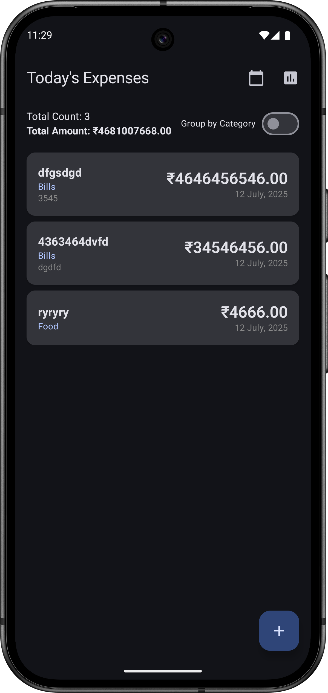
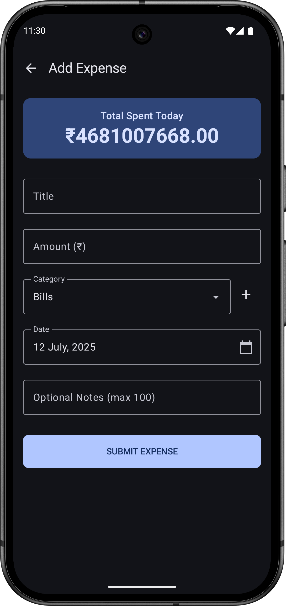
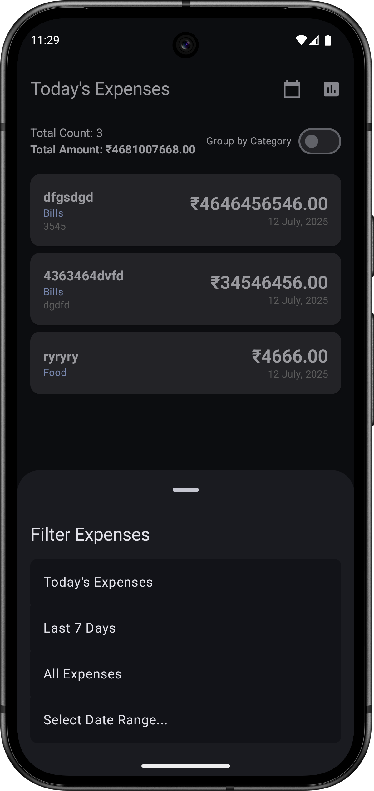
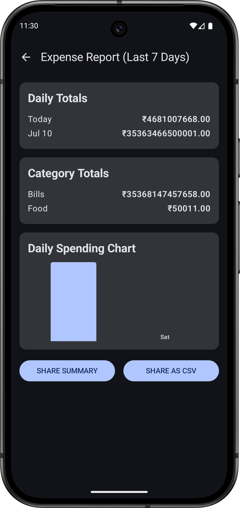

# FinPulse - Smart Daily Expense Tracker

FinPulse is a modern, offline-first expense tracking module for Android, designed to help small business owners digitize their operations. It provides a simple yet powerful interface to capture, view, analyze, and export daily expense records with ease.

## AI Usage Summary

This project was developed iteratively using a large language model (AI assistant). The AI was instrumental in generating the initial full-stack module, including the Room database, ViewModel, and Jetpack Compose UI. It was then used to refactor the entire application for dependency injection with Koin, implement complex features like dynamic categories, and add UI components like date pickers and bottom sheets. The AI also played a crucial role in troubleshooting specific code issues, such as pointer input consumption on disabled text fields, and generating the complex boilerplate required for secure file I/O (PDF/CSV generation via `FileProvider`).

## Prompt Logs

The following is a log of key prompts used to guide the AI during development:

<details>
<summary><strong>Initial Module Generation</strong></summary>

```
Build a Full-featured “Smart Daily Expense Tracker” Module for Small Business Owners
...
Required Screens & Flows: Expense Entry Screen, Expense List Screen, Expense Report Screen
...
State Management & Data Layer: ViewModel + StateFlow (or LiveData), In-memory repository or Room (optional)
...
Bonus Challenges: Theme switcher, Persist data locally (Room), Animation on add, Validation, etc.
```
</details>

<details>
<summary><strong>Refactoring for Dependency Injection</strong></summary>

```
use koin
```
</details>

<details>
<summary><strong>Implementing Dynamic Categories</strong></summary>

```
make it category dynamically, only required changes not whole code
```
</details>

<details>
<summary><strong>Adding Date Selection to Entry Form</strong></summary>

```
in explence entry add date option
```
</details>

<details>
<summary><strong>Troubleshooting a UI Bug</strong></summary>

```
OutlinedTextField(
    value = formatDate(selectedDateMillis),
    readOnly = true,
    modifier = Modifier.clickable { showDatePicker = true }
)

click not working
```
</details>

<details>
<summary><strong>Implementing File Export</strong></summary>

```
replace with pdf and csv file genrate
```
</details>

<details>
<summary><strong>Adding Advanced Filtering UI</strong></summary>

```
in [ExpenseListScreen] replace with bottom sheet scaffle for change date
```
</details>

<details>
<summary><strong>Enhancing Filtering with Date Range</strong></summary>

```
DateFilterType add type for select date in range
```
</details>

## Features Checklist

- [x] **MVVM Architecture**: Clean, scalable, and testable architecture.
- [x] **Jetpack Compose**: Entire UI built with modern, declarative toolkit.
- [x] **Room Database**: Local, persistent storage for offline-first support.
- [x] **Koin Dependency Injection**: For clean separation of concerns.
- [x] **Expense Entry Screen**:
    - [x] Title, Amount, Notes fields.
    - [x] Validation (non-empty title, amount > 0).
    - [x] **Dynamic Categories**: Select from a list or add new categories.
    - [x] **Date Selection**: Choose a custom date for the expense via a date picker.
- [x] **Expense List Screen**:
    - [x] **Advanced Date Filtering**:
        - Filter by Today, Last 7 Days, or All Time.
        - Select a custom date range using a `DateRangePicker`.
        - UI implemented with a `BottomSheetScaffold`.
    - [x] Group expenses by category.
    - [x] Displays total count and amount.
    - [x] Animated list updates.
    - [x] Clean empty state.
- [x] **Expense Report Screen**:
    - [x] Displays daily and category-wise totals for the last 7 days.
    - [x] Mock bar chart for data visualization.
    - [x] **Real File Export**:
        - Generate and share a real **PDF** summary.
        - Generate and share a real **CSV** file with all expense data.
        - Secure file sharing implemented with `FileProvider`.

## APK Download Link
You can download and install the latest APK for testing from the link below.
**[Download FinPulse APK](https://raw.githubusercontent.com/Jdbarad/FinPulse/refs/heads/main/FinPulse-release.apk)**

## Screenshots

<table>
  <tr>
    <td align="center"><strong>Expense List (with Filter)</strong></td>
    <td align="center"><strong>Expense Entry (with Date Picker)</strong></td>
  </tr>
  <tr>
    <td></td>
    <td></td>
  </tr>
  <tr>
    <td align="center"><strong>Date Filter Bottom Sheet</strong></td>
    <td align="center"><strong>Expense Report</strong></td>
  </tr>
  <tr>
    <td></td>
    <td></td>
  </tr>
</table>
